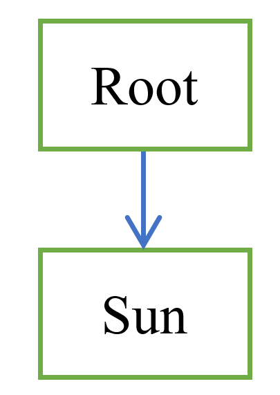
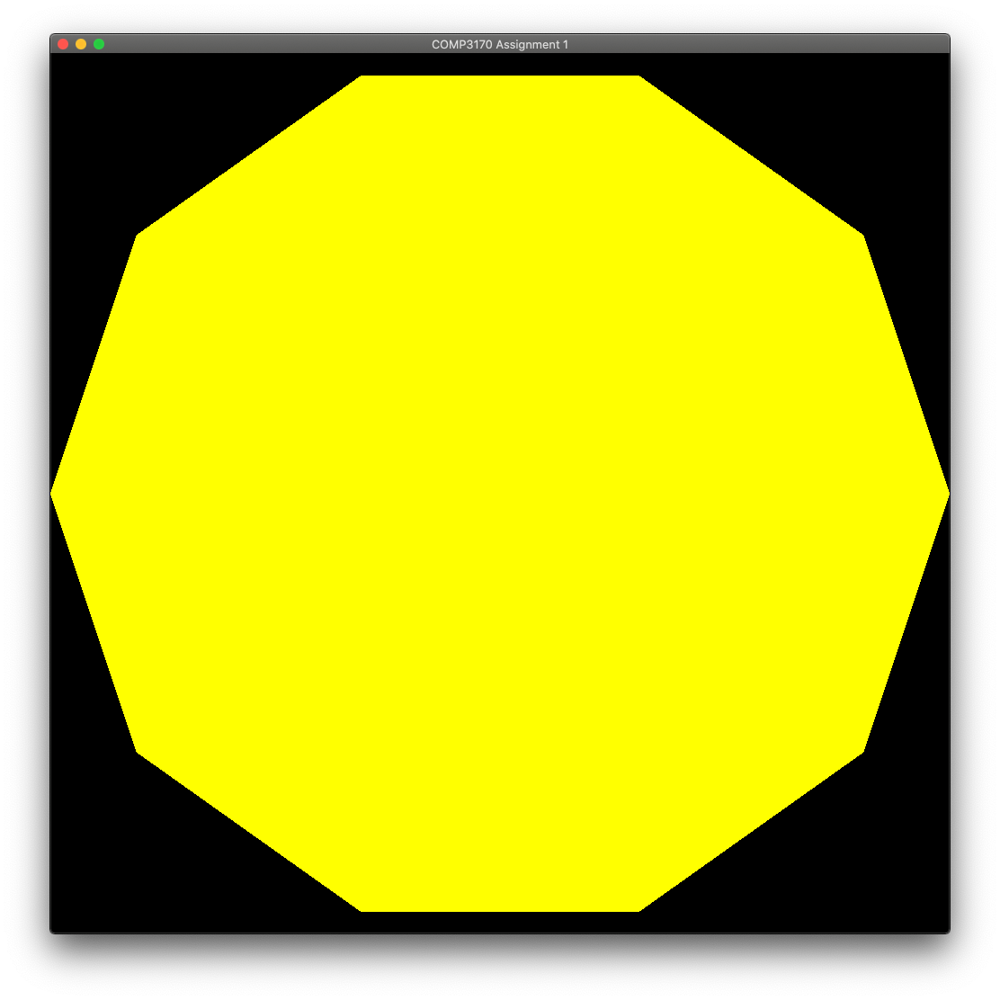
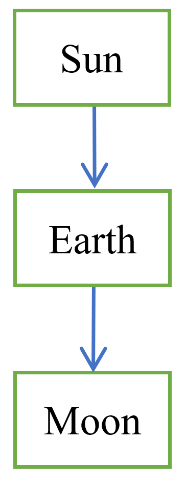
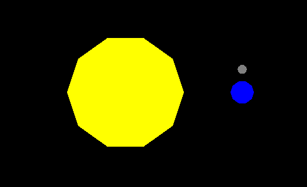
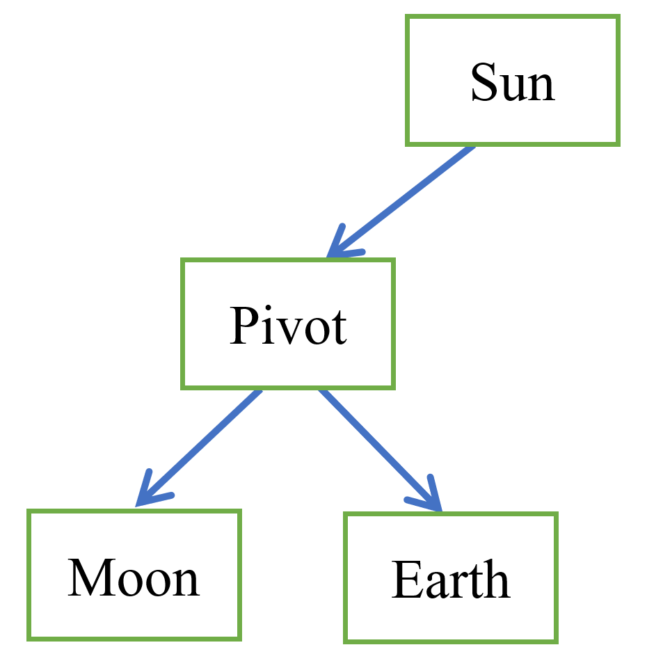

# COMP3170 - Week 5: Scene Graph

In this exercise we are going to make a solar system simulation, with planets and moons, to illustrate how to build scene graphs.

This project contains a base implementation of a scene graph, using the `SceneObject` class provided to you in the lwjgl package. This class takes care of a lot of the under-the-hood scene graph functionality, and you will be expected to understand and utilise this in your assignments.

## Framework
In the eclipse project you will find the classes:
`Week5` – IWindowListener implementation.
`Scene` – A simple scene class that extends SceneObject.
`Circle` – A simple example of an object that extends SceneObject.


## The Scene Graph
Take a look at the SceneObject class in the LWJGL wrapper comp3170 package and become familiar with how it works. It is a simple implementation of a tree. Each object is a node in the tree, connected to its parent and children.

We construct a scene graph by connecting SceneObjects together using the `setParent()` method. 

Each object in the tree has a coordinate frame matrix that converts from the object’s local coordinate frame to the parent’s coordinate frame. You can access this matrix using the `getMatrix()` method.

When we draw a scene, we recursively descend the scene graph, calculating the world matrix as we go. This is done in the `draw()` method.

The default `drawSelf()` method does nothing. We can override this method on subclasses in order to draw specific shapes. Take a look at how the `Circle` class extends `SceneObject` to implement this method.

You will also be using this` SceneObject` class in Assignment 1, so this is a good opportunity to familiarise yourself with how it works, and how to use it in your code.

### Creating a Scene Graph
We now want to start creating a scene graph so we can attach objects to each other and define transformations between them. The initial scene graph looks like this:



The code to set this up is in the `Scene` class:

```
// construct objects and attach to the scene-graph
root = this;
		
sun = new Circle(); // Create the sun
sun.setColour(Color.YELLOW);
sun.setParent(root); // Place the sun in the scene graph.
```

Notice the root is just the Scene itself, a basic SceneObject. It doesn’t draw anything itself. It is a container for attaching children. Every object in your scene should be a descendant of the root object.

Have a look at the `draw()` method in `Week5`:

#### Week5
```
public void draw() {
	glClear(GL_COLOR_BUFFER_BIT);		
	scene.draw(); // Draw the scene, which will draw all its children.
}
```

The code is quite simple - `scene.draw()` will recursively draw the entire scene (working through the scene graph and applying matricies).

### Transformations
If you run this, you will see the sun fills the screen:



We are working in NDC coordinates without a view matrix, so a circle with radius 1 will be as big as the window. We could fix this by adding a camera (as we did last week) but for simplicity’s sake we will keep working in NDC and scale everything appropriately.

You can apply transformations to scene objects by calling `getMatrix()` to access its matrix and then using appropriate methods from JOML’s `Matrix4f` class to apply transformations to the coordinate frame. Make sure to read the documentation for more info: https://joml-ci.github.io/JOML/apidocs/org/joml/Matrix4f.html

Note: Although we are working in 2D, we are using 3D coordinates (and therefore `Matrix4f`) with the z-coordinate set to zero, because this makes the JOML code simpler and easier to follow. Just remember to include a z-coordinate for translations, and use the `rotateZ()` method to rotate in 2D.


```
Circle sun = new Circle(shader);
sun.setColour(Color.YELLOW);
sun.setParent(root);

// access the sun’s local coordinate frame matrix
Matrix4f matrix = sun.getMatrix();
matrix.translate(1,0,0);  // move 1 unit to the right
matrix.rotateZ(TAU/12);   // rotate 30 degrees
matrix.scale(0.1f);       // scale to 1/10 size

// alternatively, a shorthand form is:
sun.getMatrix().translate(1,0,0).rotateZ(TAU/12).scale(0.1f);
```

## Task 1: Adding objects
Scale the Sun down to a resonable size. Add the Earth and the Moon to the scene graph as: 



Position and scale everything correctly, to look something like this:



When you've got everything in position, try re-scaling the size of the Sun. How are the Earth and Moon affected? Why is this happening?

## Task 2: Adding animation
Add an `update()` method as shown in lectures.Add code to make the Earth rotate at a fixed speed (remember to take the `deltaTime` into account).

What happens? Why? Stop and think about this. Try to work out the answer before continuing. Make some notes in your workbook.

## Task 3: Empty Objects
The issue is that the Moon is attached to the Earth in the scene graph, so inherits its coordinate frame. When the Earth is rotated, the Moon moves with it. In this case, this is not the behaviour that we want. We can solve this with a more complicated scene graph:



Rather than attaching the Moon to the Earth, we attach both objects to an invisible `Pivot` object. The Earth can then be rotated about the pivot without affecting the position of the Moon.

## Task 4: Complete the scene
### Earth and moon
Add more animation code so that:
* The Sun does not rotate.
* The Earth rotates on its axis once per ‘day’.
* The Earth goes around the Sun once per ‘year’.
* The Moon goes around the Earth once per ‘month’.
* You can decide what appropriate periods for a ‘day’, ‘month’ and ‘year’ might be.

To do this you will need to add more pivot points to your scene graph. Draw the scene graph you are using in your workbook.

### Mars and its moons
Add Mars, and its two moons Phobos and Deimos to your scene graph.
Draw the scene graph you are using in your workbook.

### To receive your mark for today, show your demonstrator:
* Your completed scene graph in your work book.
* Your planets and moons moving and rotating correctly.

## Challenge: Moving the Camera
So far, our camera has been stationary, but often we want to attach our camera to an object in the scene so that it moves with that object. To do this we need to calculate a view matrix for the camera. 

Recall that the view matrix is the inverse of the camera’s world matrix, i.e. it maps from (global) world coordinates to (local) camera coordinates.

Suppose we want to attach a camera to the Earth, so we get an Earth-centric view of how the Sun, Moon and Mars rotate around it. We can achieve this in the following steps:

* Add code for view matrix and projection matrices to the shader (this will require new uniforms).
* Create a ‘camera’ scene object.
* Attach it as a child of the Earth in the scene-graph.
* Add a method to the camera to access its model matrix.
* How can you split this into TR and S components? (This is tricky)
* Use the `Matrix4f.invert()` method to invert this matrix to give you the view and projection matrices
* Pass these values into the shader.

Try changing the camera’s parent in the scene graph and see what results you get.